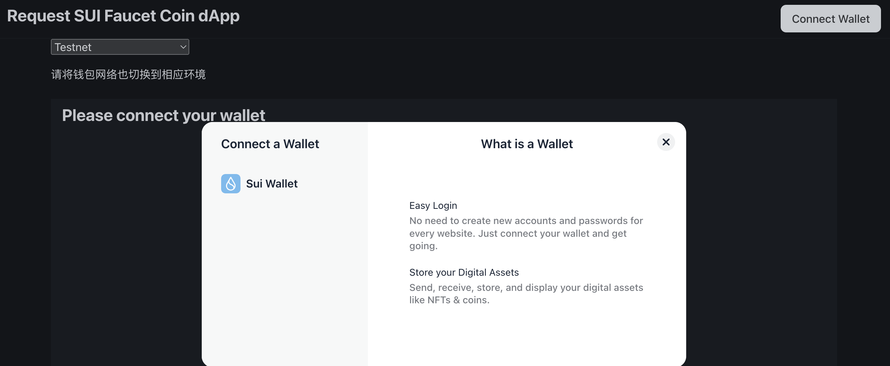
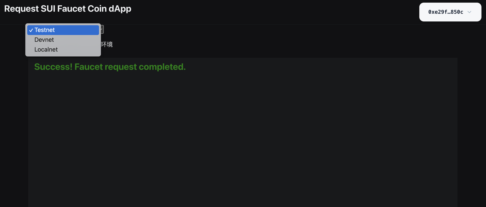

# Sui链获取Faucet coin
[官方sdk文档](https://sdk.mystenlabs.com/dapp-kit)

## pnpm 安装部署
install pnpm
```shell
npm i pnpm -g
```
To install dependencies
```shell
pnpm install
```
To start your dApp in development mode run
```shell
pnpm dev
```
## npm 安装部署
To install dependencies
```shell
npm install
```
To start your dApp in development mode run
```shell
npm run dev
```

## 示例
- 1.连接钱包


- 2.选择网络，获取水龙头
  
